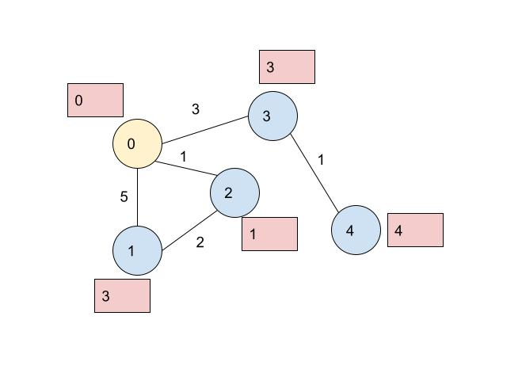

# algo-memo
アルゴリズムに関する個人的な備忘録です。今のところ雑多です


### Dijkstra法
<p align="left">
  
</p>
Fig. dij-1.

```
ある点からの最短距離を求めるときに便利なアルゴリズムです。
以下の実装は Figure dij-1 のようなグラフにおいて、黄色い点からスタートして、他の点に着くまでの最短距離(赤いラベルの数字)を求めたものです。
1) TODO
2) TODO
3) TODO


//
// 実装
//
#include <climits>
#include <queue>
#include <vector>

#include <iostream>

class Edge {
public:
  int next;
  int len;
  Edge(int a, int b) : next(a), len(b) {}
};

using Graph = std::vector<std::vector<Edge>>;
using Pair = std::pair<int, int>; // dis[i], i

void dij(Graph &g, int start, std::vector<int> &dis) {
  int g_size = g.size();
  std::priority_queue<Pair, std::vector<Pair>, std::greater<Pair>> pq;

  // 1)
  dis = std::vector<int>(g_size, INT_MAX);
  dis[start] = 0;
  pq.emplace(dis[start], start);

  while (!pq.empty()) {
    Pair p = pq.top();
    pq.pop();

    // 2)
    int cur_dis = p.first;
    int idx = p.second;
    if (dis[idx] < cur_dis) {
      continue;
    }

    for (auto e : g[idx]) {
      int next = e.next;
      int len = e.len;

      // 3)
      if (dis[next] > cur_dis + len) {
        dis[next] = cur_dis + len;
        pq.emplace(dis[next], next);
      }
    }
  }

  return;
}

int main(void) {
  Graph g = {
    {Edge(1,5), Edge(2,1), Edge(3,3)},
    {Edge(0,5), Edge(2,2)},
    {Edge(0,1), Edge(1,2)},
    {Edge(0,3), Edge(4,1)},
    {Edge(3,1)}
  };
  int start = 0;
  std::vector<int> dis;

  dij(g, start, dis);

  // 結果の確認
  for (auto d : dis) {
    std::cout << d << " ";
  }

  return 0;
}
```


### Kadane法 (TBD)
### Kruskal法 (TBD)
